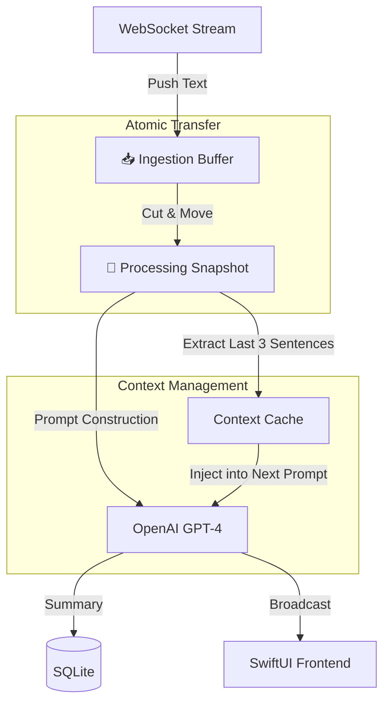

# 🧠 AI-Powered Real-Time Memory Assistant

> **A macOS-native productivity tool that turns voice conversations into structured knowledge.** featuring real-time transcription, intelligent context-aware summarization, and local semantic search.

---

## 📖 Overview

This project is a full-stack AI application designed to close the loop between **capturing information** and **retrieving knowledge**. Unlike traditional recorders that leave you with hours of raw audio, this assistant acts as a "second brain":

1. **Listens** using low-latency transcription (ElevenLabs Scribe). Chose between 'Lecture' and 'Discussion' mode.
2. **Thinks** by generating structured, context-aware summaries every ~120 seconds (GPT-4).
3. **Remembers** by indexing content locally for semantic retrieval (FAISS + SentenceTransformers).

It creates a seamless pipeline from **Speech**  **Text**  **Insight**  **Long-term Memory**.

---

## 📸 Screenshots

| Real-time Transcription | Transcripts Record | Semantic Search |
| --- | --- | --- |
| |   |  |

---

# Realtime Transcriber User Handbook
## 📥 Download

**[Latest Release (v1.0.1)](https://github.com/DWGqaz123/realtime_transcriber_WG/releases/latest)**

## 🚀 Quick Start

1. Download and install the app
2. Configure API keys in Settings
3. Start recording and transcribing!

[Full documentation →](docs/)

## 🛠️ Development

### Requirements

- macOS 12.0+
- Xcode 14.0+
- Python 3.10+
- Conda

### Setup
```bash
# Clone repository
git clone https://github.com/你的用户名/realtime_transcriber_WG.git
cd realtime_transcriber_WG

# Setup backend
cd backend
conda create -n realtime_transcriber_env python=3.10
conda activate realtime_transcriber_env
pip install -r requirements.txt

# Open frontend in Xcode
cd ../frontend_mac/RealtimeTranscriberMac
open RealtimeTranscriberMac.xcodeproj
```

## ✨ Key Features

### ⚡️ Real-Time Intelligence

* **Live Transcription:** Integrated with ElevenLabs Scribe v2 for <100ms latency speech-to-text.
* **Smart Ticker:** Generates structured summaries (bullet points & action items) in real-time without interrupting the transcription flow.
* **Adaptive Triggering:** Uses a hybrid algorithm (Time + Sentence Count + Semantic Integrity) to ensure summaries are generated at natural pauses, not arbitrary time cuts.

### 🧠 Long-Term Memory (RAG)

* **Local Vectorization:** Uses `paraphrase-multilingual-MiniLM-L12-v2` to embed text locally on the CPU (~6 texts/sec). **Zero API cost for storage.**
* **Semantic Search:** Built on **FAISS (Facebook AI Similarity Search)**. Find content by meaning (e.g., query "Budget issues" to find segments about "financial constraints").
* **Asynchronous Indexing:** Indexing happens in the background via non-blocking tasks, ensuring the UI never freezes.

### 🛡️ Architecture Highlights

* **Double-Container Buffering:** Solves the data-loss problem common in streaming applications.
* *Ingestion Buffer:* Always open for incoming audio text.
* *Processing Snapshot:* Atomically isolated for LLM inference.


* **Privacy First:** Vector embeddings and databases (SQLite + Chroma/FAISS) are stored locally on the user's machine.

---

## 🏗 System Architecture

### 1. The "Double-Container" Pipeline

One of the core engineering challenges was handling the race condition between the continuous WebSocket stream and the latent LLM inference.



### 2. The Local RAG Engine

A privacy-focused implementation of Retrieval-Augmented Generation.

* **Ingest:** Finished sessions are chunked.
* **Embed:** `SentenceTransformers` (Local CPU) converts chunks to 384-dimensional vectors.
* **Index:** Vectors are stored in a `FAISS IndexFlatIP` structure for efficient cosine similarity search.
* **Retrieve:** User queries are vectorized and matched against the index to return the Top-K relevant segments.

---

## 🛠 Tech Stack

### Backend (Python 3.10+)

* **Framework:** FastAPI (Async Web Server)
* **Real-time:** WebSockets
* **Database:** SQLAlchemy + SQLite
* **AI & ML:**
* OpenAI API (Summarization)
* ElevenLabs API (Scribe v2 STT)
* SentenceTransformers (Local Embedding)
* FAISS (Vector Indexing)


### Frontend (macOS)

* **Language:** Swift 5
* **UI Framework:** SwiftUI
* **Architecture:** MVVM + Combine
* **Audio:** AVFoundation (High-performance capture)

---

## 📄 License

Distributed under the MIT License. See `LICENSE` for more information.

---

## 📧 Contact

**Winston (Wenguang) Dong** Master of Information Systems Management @ CMU

[https://www.linkedin.com/in/wenguang-qaz1105/] | [wenguand@andrew.cmu.edu]

---

*Built with ❤️ at Carnegie Mellon University*
