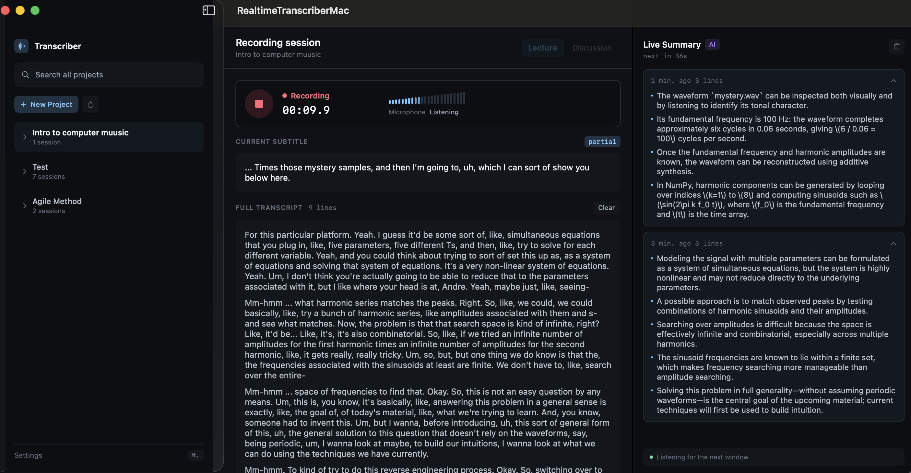
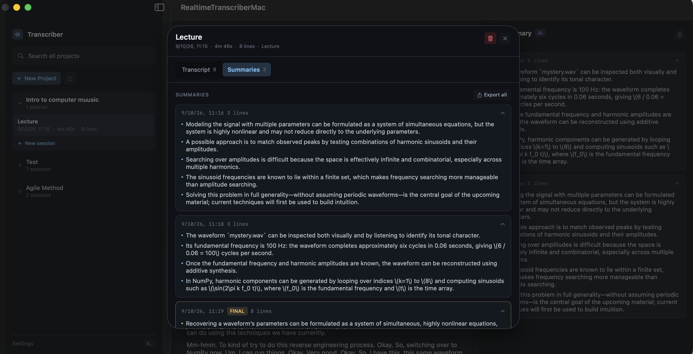

# Realtime Transcriber

> A macOS app that turns voice conversations into structured knowledge — real-time transcription, auto-generated summaries, and hybrid search across your sessions.

**[Download Latest Release](https://github.com/DWGqaz123/realtime_transcriber_WG/releases/latest)**


*Live subtitles and confirmed transcript on the left, AI notes accumulating on the right — while the recording is still running.*


*Every session keeps its full transcript alongside the summaries it produced, including the final one generated on stop.*

---

## What it does

1. **Transcribes** live audio via ElevenLabs Scribe v2 Realtime Turbo (~150ms partial latency). Choose between Lecture or Discussion mode, and mix languages in a single sentence.
2. **Summarizes** with GPT-5.6 Luna on windows that close at sentence boundaries, not on a fixed timer — elapsed time only opens the gate; the window also needs at least three accumulated sentences *and* a latest one that actually ended, with a hard ceiling so an unbroken stretch of speech can't stall it indefinitely. Context carries across windows.
3. **Searches** across every project with hybrid retrieval — dense vectors for meaning, BM25 for exact terms, fused by Reciprocal Rank Fusion.

---

## Getting Started

1. Download and open the `.dmg` from [Releases](https://github.com/DWGqaz123/realtime_transcriber_WG/releases)
2. Drag the app to Applications
3. On first launch, go to **Settings (⌘,)** and enter your API keys:
   - **OpenAI API Key** — for summarization *and* search embeddings
   - **ElevenLabs API Key** — for transcription
4. Click **Save & Restart Backend**, then start a session

> First launch may show a Gatekeeper warning. Go to System Settings → Privacy & Security → click "Open Anyway".

---

## Requirements

- macOS 13.5 (Ventura) or later
- Apple Silicon or Intel
- Internet connection (for transcription and summarization APIs)

---

## Features

- **Live subtitles** — real-time transcription displayed as you speak
- **Auto summaries** — bullet-point summaries generated at natural pauses, no manual intervention
- **Pause and resume** — stopping saves your work; pressing Resume continues the *same* session rather than starting a new one, and paused time is excluded from the recording duration
- **Hybrid search** — combines semantic similarity with keyword matching, so both "what was that about scaling laws?" and `IndexFlatIP` find what you need
- **Global search** — queries span every project, because memory isn't partitioned by folder
- **Mixed-language transcription** — set a primary language plus any number of secondary ones for sentences that switch mid-way
- **Session management** — organize sessions into projects, add names and notes
- **Local storage** — all transcripts, summaries and vectors stay in `~/Library/Application Support/RealtimeTranscriber/`

---

## Engineering Highlights

### Double-Container Buffering

The core challenge of real-time summarization is that LLM inference (~2s) overlaps with a continuous audio stream. A naive single-buffer approach either blocks incoming transcription or corrupts the snapshot mid-inference.

The solution uses two decoupled containers:

```
Incoming transcription  →  [Ingestion Buffer]  →  atomic snapshot  →  [Processing Snapshot]  →  OpenAI
                                ↑                                                                    ↓
                           always writable                                                    context cache
```

When summarization triggers, `ingestion_buffer` is copied and immediately cleared — the stream continues writing to the now-empty buffer without any lock. The snapshot is passed to the LLM independently. The last N sentences are retained in a `context_cache` and injected as background context into the next prompt, ensuring coherence across summary windows.

### Hybrid Retrieval with Reciprocal Rank Fusion

Dense vectors handle paraphrase well but struggle with exact terms, misrecognized words, and low-semantic tokens like names — searching `IndexFlatIP` lands somewhere in the general "database" neighborhood instead of the summary that actually mentions it. BM25 is strong precisely where embeddings are weak, so the system runs both and fuses them.

The keyword index is SQLite FTS5 with the **trigram** tokenizer rather than the default `unicode61`. The default splits on whitespace, which turns an entire Chinese sentence into a single token — effectively unsearchable. Trigrams slide a 3-character window instead, giving both CJK support and substring matching (`quadratic` matches `quadratically`). The tradeoff: queries shorter than 3 characters can't match, and the system falls back to pure vector search.

Fusion uses **RRF** rather than a weighted sum, because cosine similarity (0–1) and BM25 (unbounded) live on different scales — any weighting tuned for one query distribution breaks on the next. RRF only looks at rank:

```
score(d) = Σᵢ  weightᵢ / (k + rankᵢ(d))
```

with `k = 60` damping the advantage of top positions, so documents ranked well by *both* retrievers win over one retriever's runaway favorite. Each retriever also over-fetches (3× the requested `top_k`) before fusion, so documents outside either retriever's individual cutoff can still surface on combined rank.

### Adaptive Summary Triggering

Summaries are not triggered on a fixed timer. The trigger logic uses a three-condition hybrid:

1. **Time elapsed** ≥ `SUMMARY_INTERVAL_SECONDS` (primary gate)
2. **Min sentence count** in the buffer (prevents summaries on near-empty content)
3. **Semantic integrity check** — waits for the last buffered sentence to end with a sentence-ender (`.`, `?`, `!`); skips this check and fires anyway if elapsed time exceeds `LOOSE_MODE_THRESHOLD`

This avoids cutting mid-sentence, producing more coherent summaries without complex NLP.

Because inference takes seconds while transcription keeps arriving, the trigger check and the "generation in progress" flag are claimed in a single step before the task is spawned — otherwise a second batch of sentences arriving mid-inference would launch an overlapping summary.

### Asynchronous FAISS Indexing

After a session ends, embedding and indexing happen in a background `asyncio` task, fully non-blocking to the WebSocket handler. Vectors are stored in a per-project `IndexFlatIP` (inner product, equivalent to cosine similarity on normalized vectors). The FAISS manager returns assigned vector IDs directly from `add_vectors`, eliminating the reverse-mapping lookup that would otherwise require iterating the full index.

Index files carry their dimension in the filename, so switching embedding models can never silently load an incompatible index. Because SQLite reuses deleted primary keys, deleting a summary also drops its FAISS mapping — otherwise a recycled ID would point an old vector at new content.

---

## Tech Stack

| Layer | Stack |
|-------|-------|
| Frontend | Swift / SwiftUI |
| Backend | Python / FastAPI |
| Transcription | ElevenLabs Scribe v2 Realtime Turbo |
| Summarization | OpenAI GPT-5.6 Luna |
| Search | FAISS (dense) + SQLite FTS5 trigram (BM25), RRF fusion |
| Embeddings | OpenAI `text-embedding-3-small` (1536-d) |
| Database | SQLite via SQLAlchemy |

---

## Contact

**Winston (Wenguang) Dong** — MISM @ CMU
[LinkedIn](https://www.linkedin.com/in/wenguang-qaz1105/) · wenguand@andrew.cmu.edu
